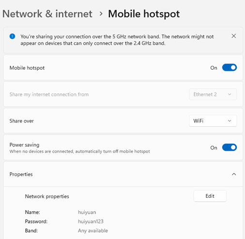
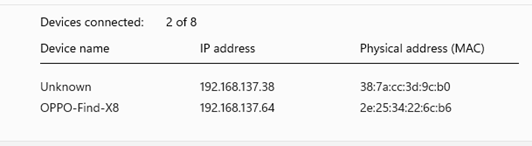
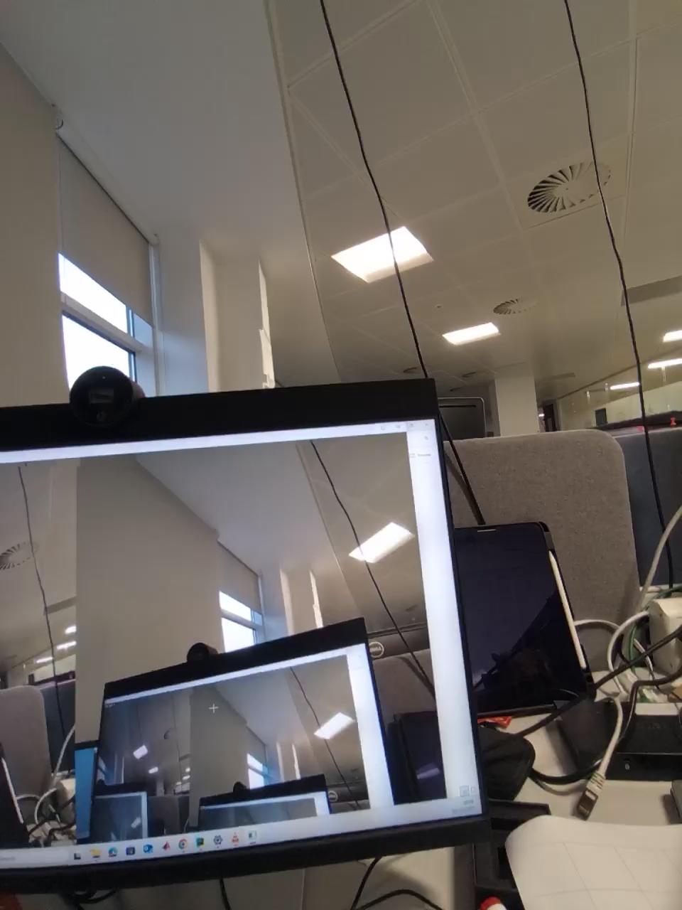

# LUCI Pin Connection Guidebook

## 📡 Overview

This guide explains how to connect and stream video from the **LUCI Pin** device on Windows or Linux systems.  
It covers network setup, LUCI app connection, and real-time video testing using VLC and the pip-installable LUCI Python SDK.

---

## ⚙️ 1. Enable Hotspot on PC

1. Turn on the **hotspot function** on your PC.  
2. Connect your **mobile phone** to this hotspot.


---

## 📲 2. Access LUCI

1. Open the **LUCI application** on your mobile phone.  
2. Connect LUCI to the **same hotspot** created by your PC.  
3. Retrieve the **IP address** assigned to your PC.  
4. Save LUCI’s **IP address** for later use.


---

## 🎥 3. Test Real-Time Video with VLC

1. Open **VLC Media Player** on your PC.  
2. Use the following RTSP URL to test the real-time video stream:

   ```bash
   rtsp://192.168.137.38:50001/live/0
   ```

3. You should now see the **real-time pin view**.

<p align="center">
  
</p>

---

## 🧬 4. Install LUCI SDK

The LUCI SDK is now distributed as a pip package.
```bash
pip install luci-sdk
```
### System Requirements

- Python ≥ 3.9

- ADB available in system PATH

- [FFmpeg](https://ffmpeg.org/) installed and accessible

The SDK automatically pulls required Python dependencies (e.g. [OpenCV-Python](https://pypi.org/project/opencv-python/)).

---

## 💾 5. Record Videos or Capture (Important!!)

The LUCI SDK provides **flexible video recording and image capture tools** for different use cases.  
You can choose from three modes depending on your experiment setup.

---

### 🎞️ (A) Standard Video Recording SDK

Record LUCI’s RTSP stream in **real time** and automatically save each 60-second segment locally.

```bash
python sdk_save_video/api.py
```
✅ **Features:**
- Uses **FFmpeg** backend  
- Outputs video segments (e.g. `recording/output_2025-08-26_17-00-00.h264`)  
- Designed for long-duration continuous recording  

Or alternatively,

```python
from luci import LUCI

luci = LUCI.connect_via_adb()
luci.video.start(
    segment_time=60,
    save_dir="recordings"
)

# ... record ...

luci.video.stop()
```

---

### ⚡ (B) Cached Recording SDK (Memory Buffer)

If you only need to **save short periods on demand**, this SDK first buffers the RTSP stream in **memory**,  
then saves the desired time range when you trigger a dump command.

```bash
python sdk_memory/api.py
```

✅ **Advantages:**
- Keeps only the latest N seconds in memory  
- Saves only important moments  
- Reduces disk I/O — ideal for high-bitrate streams

Or alternatively,

```python
from luci import LUCI

luci = LUCI.connect_via_adb()
luci.memory.start(buffer_size=60)

luci.memory.dump("last10s.ts", start=-10, end=0)
luci.memory.stop()
```

---

### 📸 (C) Single-Camera Capture SDK

Capture still images from one LUCI camera with **real-time preview**.  
Useful for calibration, documentation, or quick snapshots.

```bash
python sdk_capture/api_capture.py
```

✅ **Features:**
- Press **‘s’** → Save current frame with timestamp  
- Press **‘q’** → Exit  
- Auto filenames like:  
  ```
  cam_2025-08-26_17-05-23.jpg
  ```

Or alternatively,
```python
from luci import LUCI

luci = LUCI.connect_via_adb()
luci.capture.frame(save_dir="captures")
```

---

### 👀 (D) Dual-Camera Capture SDK

If you use **two LUCI pins** (stereo setup), this SDK allows **synchronized capture**.

```bash
python dual_luci_capture/dual_eye_threaded.py
```

✅ **Features:**
- Real-time **side-by-side preview**  
- Press **‘s’** → Save both images simultaneously  
- Auto filenames:  
  ```
  captures/cam1_2025-08-26_17-08-00.jpg
  captures/cam2_2025-08-26_17-08-00.jpg
  ```

Or alternatively,
```python
from luci import LUCI

luci = LUCI()
luci.dual.run(
    rtsp_left="rtsp://LEFT_IP:50001/live/0",
    rtsp_right="rtsp://RIGHT_IP:50001/live/0",
    save_dir="captures"
)
```

---

## 🧩 6. Dual-Eye Calibration (Stereo Calibration & Depth Estimation)

Although **LUCI Pin** is originally a **single-eye AI interactive camera** designed for wearable applications,  
we conduct a **dual-eye calibration experiment** to extend its **3D spatial perception** capabilities.

### 🎯 Why We Do This
In real-world interactive scenarios, a single LUCI Pin can perceive visual information but lacks **depth awareness** —  
it cannot directly measure how far objects are from the wearer.

To address this, we perform **dual-eye calibration** using two LUCI Pins:

- Establish intrinsic and extrinsic calibration between cameras  
- Enable **stereo rectification** and **depth estimation**  
- Simulate a **future dual-eye LUCI configuration** for depth perception, gesture tracking, and 3D understanding

This experiment bridges the gap between **monocular AI sensing** and **spatially aware perception**,  
laying the foundation for **human–machine collaboration**, **AR/VR**, and **3D AI interaction**.

---

### 🧠 What It Includes
Your calibration file (e.g. `dual_eye_calibration.yaml`) contains:

```
K1, D1: Intrinsics for camera 1
K2, D2: Intrinsics for camera 2
R, T:   Rotation & translation between cameras
R1, R2, P1, P2, Q: Rectification & projection matrices
```

These parameters are used for:
- Generating **rectified stereo pairs**
- Performing **3D depth reconstruction**
- Measuring **real-world distances**

---

### 🧬 Research Significance
By performing dual-eye calibration on a single-eye LUCI system, we can:
- Explore **depth estimation** for future LUCI designs  
- Provide **stereo ground-truth datasets** for AI learning  
- Enable **3D understanding** for interaction and robotics applications  


---

## ✅ 7. Confirm Connection

- Verify that LUCI’s real-time stream is visible in **VLC**.  
- Ensure LUCI, the **PC**, and your **phone** are all connected to the same hotspot.  
- You are now ready to use **LUCI Pin** for real-time video capture and analysis.

---

## 🧠 Notes

- For best performance, use a **stable Wi-Fi hotspot**.  
- If RTSP playback fails, check your **firewall** or **IP settings**.  
- Replace the IP address in the RTSP URL if your hotspot assigns a different one.  
- Cached recording and capture SDKs are supported on both **Windows** and **Linux**.
- Internal folders such as sdk_capture, sdk_save_video, etc. provide implementation details
- The examples directory contains ready-to-run scripts. examples/quickstart.py:
Initial setup, ADB connection, device inspection, IP caching. examples/record_video.py: Robust RTSP recording workflow with fallback logic. Examples are provided for demonstration purposes and are not part of the public API.

---

**Author:** LUCI Team  
**Last updated:** 2026
