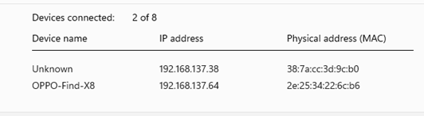

# LUCI Pin Connection Guidebook

## 📡 Overview
This guide explains how to connect and stream video from the **LUCI pin** device on Windows or Linux systems.
It covers network setup, LUCI app connection, and real-time video testing using VLC and Python tools.

---

## ⚙️ 1. Enable Hotspot on PC
1. Turn on the **hotspot function** on your PC.
2. Connect your **mobile phone** to this hotspot.


---

## 📲 2. Access LUCI
1. Open the **LUCI application** on your mobile phone.
2. Connect LUCI to the **same hotspot** created by your PC.
3. Retrieve the **IP address** assigned to your PC.
4. Save LUCI’s **IP address** for later use.



---

## 🎥 3. Test Real-Time Video with VLC
1. Open **VLC Media Player** on your PC.
2. Use the following RTSP URL to test the real-time video stream:

   ```bash
   rtsp://192.168.137.38:50001/live/0
   ```

3. You should now see the **real-time pin view**.


---

## 🧬 4. Install Dependencies
On your PC, install:
- [OpenCV-Python](https://pypi.org/project/opencv-python/)
- [FFmpeg](https://ffmpeg.org/)

These are required for video recording and image capture.

---

## 💾 5. Record Videos or Screenshots
1. Run the provided **Python script** to:
   - Record video streams
   - Capture screenshots

   Example (Python):
   ```bash
   python record_luci_stream.py
   ```

2. The script will automatically save video files or images locally.


---

## ✅ 6. Confirm Connection
- Verify that LUCI’s real-time stream is visible in VLC.
- Ensure LUCI, the PC, and your phone are all connected to the same hotspot.
- You are now ready to use LUCI Pin for real-time video capture.


---

## 🧠 Notes
- For best performance, use a stable Wi-Fi hotspot.
- If RTSP playback fails, check your firewall or IP settings.
- Replace the IP address in the URL if your hotspot assigns a different one.

---

**Author:** LUCI Team  
**Last updated:** 2025
